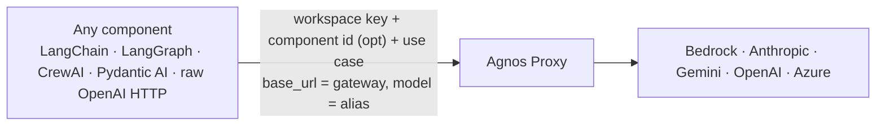
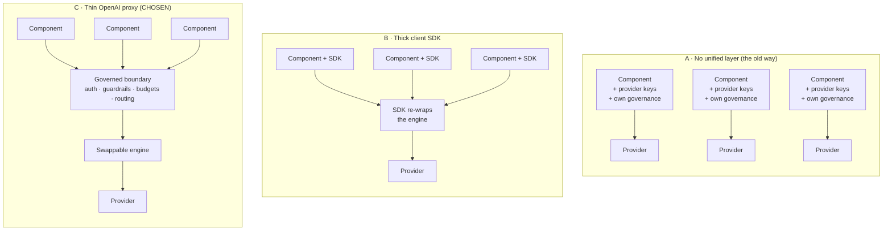
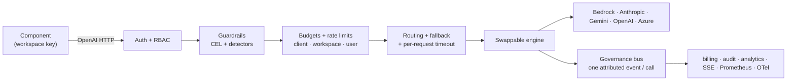
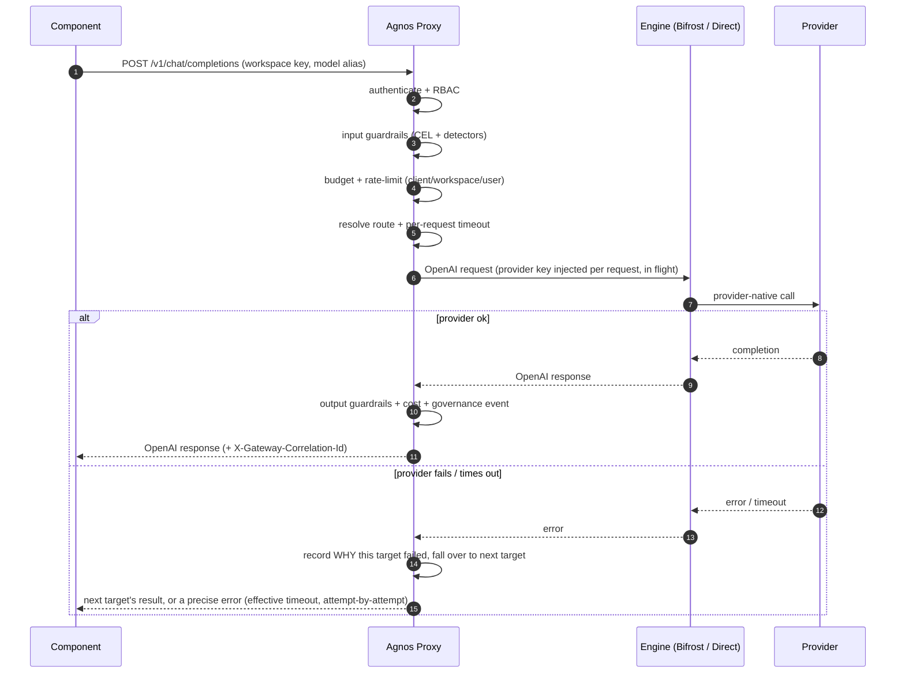
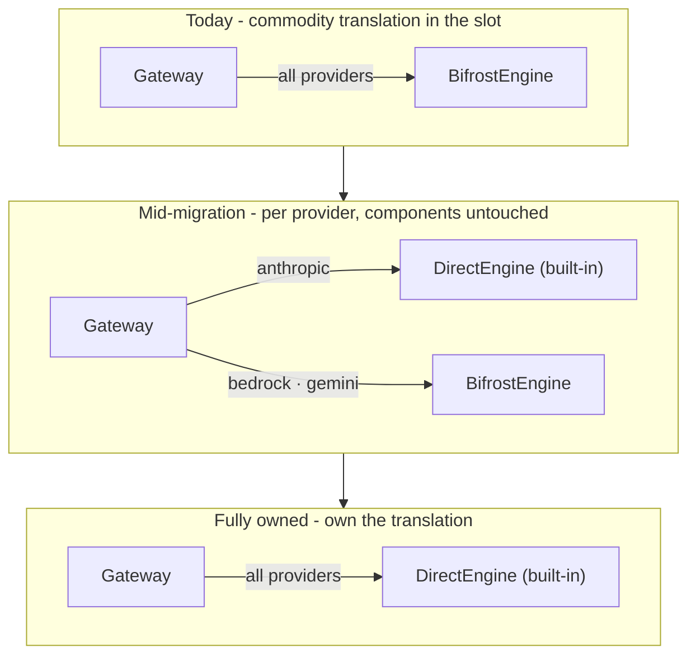
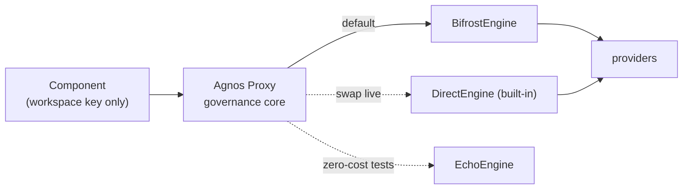
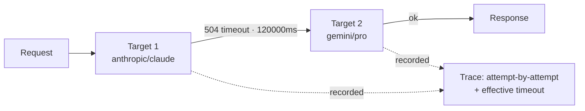

# Agnos Proxy - Architecture

> A thin, **OpenAI-compatible governance proxy** over a **swappable engine**. A
> component points its `base_url` at the gateway and sends **one workspace key** -
> nothing else. Credentials, policy, routing, budgets, guardrails and attribution
> all live at the boundary, never in the component.
>
> **Real-world usage:** in one internal workspace (`eshop-ecommerce`) Agnos has governed
> **~1,025 calls (~65M input tokens)** on Anthropic + Gemini - each authenticated,
> guard-railed, attributed and cost-accounted at the boundary.

We evaluated several designs and shipped the thin proxy. This document is the
side-by-side case for *why*, and exactly how a request flows. All diagrams render
natively on GitHub (Mermaid).

---

## 1. The contract: a component sends three things

A component never holds provider credentials, model config, or any
guardrail/chunking/streaming logic. It changes **one line** (`base_url`) and sends:

1. a **workspace key** (identity + policy),
2. an optional **component id** (attribution),
3. a **use case** (attribution / analytics).

If a component is ever compromised, there are **no provider keys to steal** and no
governance to bypass - the boundary still enforces everything.

---

## 2. Three architectures, one decision

| | A · No layer | B · Thick SDK | C · Thin proxy (chosen) |
|---|---|---|---|
| Provider credentials | in every component | in every component | only at the boundary |
| Governance | rebuilt N times | shared, but embedded in every component | one place, always on |
| Adoption | none, but unsafe | every component embeds + versions an SDK | one `base_url` change |
| Re-wraps the engine | n/a | yes (duplicates engine features) | no |
| Swap the engine | impossible | leaks into every component | config change, components untouched |

---

## 3. The governed core (what runs on every call)

Everything except provider translation runs in our layer (DB + governance bus), so
an engine swap can never remove it.

---

## 4. End-to-end request flow

---

## 5. Incremental, per-provider engine swaps (zero component change)

The piece that translates to each provider is a **swappable engine behind the
boundary**. If the default engine (Bifrost, or a Pydantic-AI-style runtime) ever
loses trust - a CVE, an outage, or just a strategic decision to own it - we migrate
to the built-in **DirectEngine** adapter **one provider at a time**. Because it is a
proxy and **not an SDK**, components never bump a version: at most the URL path
moves `v1 -> v2`; everything else stays fixed. Only the gateway proxy evolves.

Three engines are registered today: **Bifrost** (default, Go sidecar),
**DirectEngine** (boto3/in-process, proof-of-swap), **EchoEngine** (deterministic,
`$0` integration tests).

---

## 6. Reliability: timeouts and failover

- **Per-request timeout** is enforced by the gateway itself (`asyncio.wait_for`)
  using each target's configured value (header override `X-Gateway-Timeout` wins,
  else provider config, else default), clamped to a 2h ceiling for long-running
  use cases like spec generation.
- The engine's provider-level timeout is raised to that ceiling on sync, because
  this Bifrost build ignores per-key `network_config` - so without it, Bifrost's
  global 30s default silently cut long calls and reported a misleading "default is
  30 seconds". The gateway now reports the timeout it *actually* applied.
- **Failover** tries an ordered target list; every attempt is recorded **in order
  with the reason it failed** (status, error type, message), so the trace explains
  *why* each earlier target dropped out - not just that it was tried.

---

## 7. Stack

Python 3.12 · FastAPI · httpx · SQLAlchemy/asyncpg (Postgres) · tiktoken ·
cel-python · presidio · OpenTelemetry · Prometheus · Redis · Kafka · Bifrost (Go) ·
React + Vite + Tailwind dashboard. See [`README.md`](./README.md) for the endpoint
matrix, quickstart, benchmarks, and the test trust-ladder.
