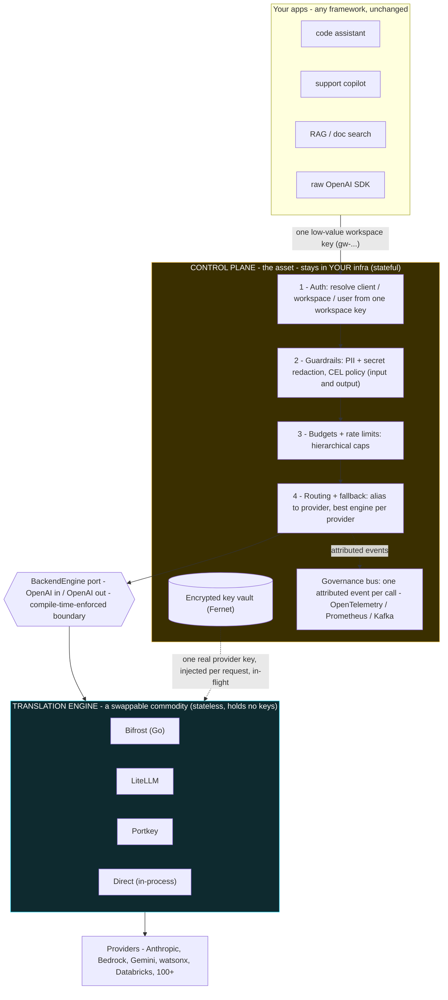

# Agnos Proxy

[](https://github.com/siva010928/agnos-proxy-oss/actions/workflows/ci.yml)
[](LICENSE)
[](CONTRIBUTING.md)
[](pyproject.toml)
[](https://github.com/siva010928/agnos-proxy-oss/releases)
[](CHANGELOG.md)

**The gateway-agnostic control plane for LLM routing, cost-tracking and observability.**

Agnos Proxy is an **OpenAI-compatible governance proxy** that sits between your apps and the model
providers. Point any app at it (change one `base_url`, send **one workspace key**) and it inherits
centralized credential isolation, guardrails, budgets, rate-limits, routing/fallback, cost
attribution and full observability - for **any** provider, behind **any** translation engine.

> ### Own the control plane. Swap the translator.
> The governance boundary and the **encrypted key vault stay in your own infrastructure**. The
> provider-translation layer is a **swappable, stateless commodity** in a fixed slot: plug in
> **Bifrost**, **LiteLLM**, **Portkey**, or the built-in **Direct** engine - and swap them **per
> provider**, live, with one config change. A CVE in a translation engine becomes a *quarantine &
> evacuate* config flip, not a fleet rebuild.

MIT-licensed. Self-host the whole thing. **Try the [live demo](https://agnos-llm-gateway.site)** - a
prototype playground (no sign-up, no keys, deterministic responses).

> **Status: pre-1.0.** Fully usable and self-hostable today, but public APIs, config keys and the
> dashboard may still change before v1.0 - pin a [release](https://github.com/siva010928/agnos-proxy-oss/releases) for stability.

---

## Contents

- [Why](#why)
- [Architecture](#architecture-hexagonal--ports-and-adapters)
- [Engines](#engines--pick-the-best-per-provider-swap-at-runtime)
- [Features](#features)
- [Install](#install)
- [Quickstart](#quickstart-self-host-everything-real)
- [Calling the gateway](#calling-the-gateway)
- [Request / response headers](#request--response-headers)
- [Error codes](#error-codes)
- [The dashboard](#the-dashboard)
- [Configuration](#configuration)
- [Local development](#local-development)
- [Testing](#testing)
- [Security model](#security-model)
- [Project layout](#project-layout)
- [Editions](#editions)
- [Contributing](#contributing)
- [License](#license)

---

## Why

Every app is becoming an LLM consumer, so teams put a gateway in front. That gateway secretly does
**two very different jobs**:

- **Control plane (the asset):** identity, guardrails, budgets, the **key vault**, cost + audit. It
  remembers everything and holds your secrets.
- **Data plane (a commodity):** translating the OpenAI request shape into each provider's shape and
  back. It's fast-moving third-party code and the largest attack surface.

Most popular gateways **fuse both jobs into one process** - so untrusted, fast-moving translation
code runs next to your key store, and a single flaw in the gateway process can reach every key. This
is not hypothetical: LiteLLM (a leading OSS gateway, which Agnos Proxy also supports as a *contained*
engine) disclosed a **pre-auth SQL injection in its API-key-verification path**
([CVE-2026-42208](https://github.com/BerriAI/litellm/security/advisories/GHSA-r75f-5x8p-qvmc)), an
**admin file-read** via the connection-test endpoint
([CVE-2026-59819](https://nvd.nist.gov/vuln/detail/CVE-2026-59819)), and a **low-privilege-user ->
admin -> remote code execution** chain
([CVE-2026-47101/47102/40217](https://www.obsidiansecurity.com/blog/litellm-privilege-escalation-rce),
CVSS 9.9). When the gateway also *holds the keys*, such a compromise reaches the master key, the salt
that decrypts stored provider keys, and every provider credential at once. The other common shape
**hosts the control plane in a vendor cloud**, so your keys and prompts leave your network.

Agnos Proxy takes the third path: **keep the control plane + vault in your own infrastructure, and
treat the engine as a disposable, stateless adapter behind a fixed port** - so a breached engine
reaches at most **one in-flight key**, never the vault. Same binary (e.g. LiteLLM), opposite blast
radius: run it as your whole gateway and one bug takes everything; run it as our adapter and worst
case is a single in-flight key.

<details>
<summary><strong>References</strong> - sources for the claims above</summary>

- **CVE-2026-42208** - pre-auth SQL injection in LiteLLM's API-key-verification path.
  [LiteLLM advisory (GHSA-r75f-5x8p-qvmc)](https://github.com/BerriAI/litellm/security/advisories/GHSA-r75f-5x8p-qvmc)
  · [LiteLLM write-up](https://docs.litellm.ai/blog/cve-2026-42208-litellm-proxy-sql-injection)
  · [Sysdig analysis](https://www.sysdig.com/blog/cve-2026-42208-targeted-sql-injection-against-litellms-authentication-path-discovered-36-hours-following-vulnerability-disclosure)
- **CVE-2026-59819** - privileged file read via the `/health/test_connection` endpoint.
  [NVD](https://nvd.nist.gov/vuln/detail/CVE-2026-59819)
  · [LiteLLM advisory (GHSA-4g5m-c9r5-49xf)](https://github.com/BerriAI/litellm/security/advisories/GHSA-4g5m-c9r5-49xf)
- **CVE-2026-47101 / 47102 / 40217** - low-privilege-user -> admin -> RCE chain (CVSS 9.9), fixed in LiteLLM `v1.83.14-stable`.
  [Obsidian Security research](https://www.obsidiansecurity.com/blog/litellm-privilege-escalation-rce)
  · [NVD CVE-2026-40217](https://nvd.nist.gov/vuln/detail/CVE-2026-40217)
- Engines referenced above: [Bifrost](https://github.com/maximhq/bifrost) · [LiteLLM](https://github.com/BerriAI/litellm) · [Portkey Gateway](https://github.com/portkey-ai/gateway)

> These are cited as public, **already-fixed** examples of why we contain the translation engine
> behind a hard boundary - not as a knock on any project. LiteLLM patched every one of them, and
> Agnos Proxy ships LiteLLM as one of its supported engines. The architectural point applies to
> **any** design that fuses the key vault into the translation process.

</details>

## Architecture (hexagonal / ports-and-adapters)



- **Per-request key injection.** The control plane pulls one provider key from the vault for a single
  call and hands it to the engine in flight; the engine stores nothing.
- **Per-provider, multi-engine routing.** Run several engines at once and route each provider to the
  best one (fast Bifrost for most traffic; the widest-coverage engine for a provider only it
  supports). Move a provider onto your own engine **gradually** (weighted split), with zero downtime.
- **Compile-time-enforced boundary.** An anti-coupling test fails the build if any engine-specific
  detail leaks past the `BackendEngine` port - "swappable engine" is a machine-checked invariant.

## Engines - pick the best per provider, swap at runtime

The translation engine is a **commodity in a fixed slot**. That buys two things - not just security:

**1. Security / blast-radius.** Untrusted, fast-moving translation code runs behind a hard boundary
and holds **no keys** (the control plane injects one provider key per request, in flight). A breached
or CVE'd engine is a *quarantine & evacuate* config flip - drop a clean engine into the same port - not
a fleet rebuild + key rotation.

**2. Capability - the best engine per provider.** Run several engines at once and route each
**provider** to the engine that serves it best:

| Provider(s) | Best engine | Why |
|---|---|---|
| Most traffic - Anthropic, OpenAI, Gemini, Bedrock… | **Bifrost** | Blazing-fast Go translator |
| **IBM watsonx**, **Databricks**, Snowflake, SageMaker | **LiteLLM** | The engine whose matrix actually speaks these enterprise platforms |
| Local / OSS models - Ollama, vLLM, LM Studio | **Direct** | In-process, owned; no sidecar needed |
| Anything, migrating in-house | **Direct (weighted %)** | Canary a provider onto your owned engine 10→50→100%, zero downtime |

```bash
# route the enterprise platforms to LiteLLM; keep everything else on fast Bifrost
curl -X PATCH http://localhost:8090/admin/engine-routing -H 'X-Admin-Token: <token>' \
  -H 'Content-Type: application/json' \
  -d '{"overrides":{"watsonx":"litellm","databricks":"litellm"}}'
```

No app change, one control plane, one audit trail. Engine choice is keyed off the **provider** resolved
from a **workspace/client** model+alias config, so a workspace mandated onto watsonx automatically rides
LiteLLM while the rest stay on Bifrost - and you can insource a provider onto your **owned** Direct
engine with a weighted split (`{"anthropic":10}` → `50` → `100`).

**Swap it three ways:** the dashboard **`/app/engine`** selector (all five engines - bifrost / litellm /
portkey / direct / echo - live + persisted), the API (`POST /admin/engine`), or `ENGINE=…` at cold start.
Swapping is governance-neutral (auth, guardrails, budgets, audit identical).

**Bring your own engine.** Any OSS model gateway becomes an adapter by implementing the four-method
`BackendEngine` port (OpenAI in / OpenAI out). → Full guide: **[docs/ENGINES.md](docs/ENGINES.md)** -
configure each engine, per-provider routing, gradual insourcing, and a step-by-step to add a new adapter.

## Features

- OpenAI-compatible `/v1/chat/completions` + `/v1/embeddings` (drop-in `base_url`), streaming supported.
- Encrypted provider-key vault (Fernet); apps only ever hold a low-value workspace key (`gw-…`).
- Guardrails: CEL rules + detector profiles; PII/secret redaction on input **and** output.
- Hierarchical budgets (client → workspace → user + per-model) and multi-scope rate limits.
- Routing with weighted targets, fallback chains and circuit breakers.
- Per-provider engine selection + gradual insourcing (canary %).
- Cost attribution per client/workspace/user/component; one governance event per call.
- OpenTelemetry traces (Jaeger), Prometheus metrics, optional Kafka event bus, live SSE dashboard.
- Low control-plane overhead (~1 ms median); 170+ tests runnable at **$0** on a deterministic echo engine.

## Install

Fastest paths to a running gateway - full guide in **[docs/INSTALL.md](docs/INSTALL.md)**.

| Path | Command | Best for |
|---|---|---|
| **One-liner** | `curl -fsSL https://raw.githubusercontent.com/siva010928/agnos-proxy-oss/main/install.sh \| sh` | Secure install - secrets auto-generated, keyless `echo` engine, no keys needed |
| **Prebuilt image** | `docker pull ghcr.io/siva010928/agnos-proxy:latest` | Pull the published image (pin `:v0.2.0` for a release) |
| **Compose (no build)** | `docker compose -f deploy/docker-compose.quickstart.yml up -d` | Gateway + Postgres + Redis from the prebuilt image (create `.env` first) |

The one-liner generates strong secrets, runs the keyless `echo` engine (no provider keys),
waits for health, then prints your dashboard URL + admin login. See
**[docs/INSTALL.md](docs/INSTALL.md)** for the `agnos` CLI, a single `docker run`, from-source,
and configuration.

## Quickstart (self-host, everything real)

```bash
git clone https://github.com/siva010928/agnos-proxy-oss.git
cd agnos-proxy-oss
cp .env.example .env          # set GATEWAY_MASTER_KEY (any passphrase) + provider keys
docker compose up -d          # gateway + postgres + redis + kafka + bifrost + observability
```

Open the dashboard at **http://localhost:8090/** (in `PREVIEW_MODE` it opens without a login wall).

**Prefer a prebuilt image?** Pull the published multi-arch gateway from GHCR:

```bash
docker pull ghcr.io/siva010928/agnos-proxy:latest   # or a pinned release, e.g. :v0.2.0
```

Generate a master key for the vault:

```bash
python -c "from cryptography.fernet import Fernet; print(Fernet.generate_key().decode())"
```

## Calling the gateway

Call it exactly like OpenAI - just change the `base_url` and send a **workspace key** (never a
provider key):

```bash
curl http://localhost:8090/v1/chat/completions \
  -H "Authorization: Bearer gw-key-primary-001" \
  -H "Content-Type: application/json" \
  -H "X-Gateway-Component: my-service" \
  -H "X-Gateway-User: user-123" \
  -d '{"model":"default","messages":[{"role":"user","content":"hello"}]}'
```

Python (OpenAI SDK):

```python
from openai import OpenAI

client = OpenAI(base_url="http://localhost:8090/v1", api_key="gw-key-primary-001")
resp = client.chat.completions.create(
    model="default",                       # a workspace alias, not a provider model id
    messages=[{"role": "user", "content": "hello"}],
)
print(resp.choices[0].message.content)
```

Use `"default"` (the workspace's default alias) or any registered alias - you never hold provider
credentials.

## Request / response headers

**Opt-in request headers**

| Header | Purpose |
|---|---|
| `X-Gateway-Component` | Which service/agent is calling (attribution). |
| `X-Gateway-User` | End-user / service principal for per-user budgets. |
| `X-Gateway-Use-Case` | Logical workflow label for analytics & latency views. |
| `X-Gateway-Guardrail-Mode` | Override guardrail behavior (e.g. audit vs block) for the call. |
| `X-Gateway-Auto-Truncate` | Auto-truncate over-long prompts to fit the model window. |
| `X-Gateway-Timeout` | Per-request upstream timeout. |
| `X-Gateway-Cache-TTL` | Response cache TTL for the call. |
| `Idempotency-Key` | Dedupe retried writes. |

**Response headers**

| Header | Meaning |
|---|---|
| `X-Gateway-Correlation-Id` | Trace id to line up logs / Jaeger spans. |
| `X-Gateway-Guardrail: redacted` | A guardrail redacted content in-flight. |
| `X-Gateway-Cache: HIT\|MISS` | Response cache status. |

## Error codes

| HTTP | `type` | What it means / fix |
|---|---|---|
| 401 | `authentication_error` | Bad/disabled workspace key. |
| 404 | `invalid_request_error` | Model alias not registered for the workspace. Use `default` or a registered alias. |
| 422 | `guardrail_violation` | Blocked by a guardrail rule (e.g. PII/secret). See the message for the rule. |
| 429 | `rate_limit` | RPM/TPM exceeded for user/workspace/client. Back off and retry. |
| 402 | `budget_exceeded` | Spend cap reached for the breached scope. Raise the budget or wait for the window. |

## The dashboard

A React dashboard ships with the gateway and is served at `/app` (root `/` redirects there). Pages:

- **Overview** - traffic, spend, guardrail activity and health at a glance.
- **Live Traffic** - a live SSE feed of governed requests as they happen.
- **Analytics** - cost & token analytics by client / workspace / user / model, multi-currency.
- **Request Logs** - per-request detail: routing decision, guardrails, cost, latency, trace id.
- **Platform Value** - aggregate savings / value view.
- **Routing Map** - visualize alias → provider → engine routing and weights.
- **Guardrail Rules** / **Detector Profiles** - author CEL rules and PII/secret detectors.
- **Workspaces** - tenant isolation and per-workspace configuration.
- **Onboarding** - guided setup for a new client/workspace.
- **Clients / Providers / Routing (edit) / API Keys / Pricing** - administration.
- **Observability** - links into Jaeger traces and Prometheus metrics.
- **Engine & Health** - engine status and health probes.
- **Playground** - send real governed requests from the browser and watch guardrails/routing apply.
- **Docs** - in-app integration reference.

## Configuration

All configuration is via environment variables (see [`.env.example`](.env.example)). Key ones:

| Variable | Default | Purpose |
|---|---|---|
| `GATEWAY_HOST` / `GATEWAY_PORT` | `0.0.0.0` / `8090` | Bind address. |
| `ENGINE` | `bifrost` | Translation engine: `bifrost` \| `litellm` \| `portkey` \| `direct` \| `echo`. |
| `GATEWAY_MASTER_KEY` | - | Fernet key for the encrypted workspace-credential vault (**required**). |
| `GOVERNANCE_DB_URL` | postgres@5433 | Governance datastore (Postgres). |
| `KAFKA_BROKERS` / `KAFKA_TOPIC` | empty / `agnos-proxy.governance.v1` | Optional governance event bus (empty = disabled). |
| `REDIS_URL` | empty | Distributed rate-limit store across replicas. |
| `ANTHROPIC_API_KEY`, `OPENAI_API_KEY`, `GEMINI_API_KEY`, `AWS_*`, `AZURE_OPENAI_*` | - | Provider credentials (seed source of truth). |
| `WS_KEY_*` | `gw-key-…` | Seed demo workspace keys. |
| `DASHBOARD_ADMIN_USER` / `DASHBOARD_ADMIN_PASSWORD` | `admin` / `agnos` | Dashboard login (when `PREVIEW_MODE=false`). |
| `OIDC_ISSUER` / `OIDC_CLIENT_ID` / `OIDC_CLIENT_SECRET` / `OIDC_REDIRECT_URI` | - | SSO. |
| `PLATFORM_ADMIN_TOKEN` / `SESSION_SECRET` | - | Platform admin + session signing. |
| `GOVERNANCE_MODE` | `full` | Governance pipeline mode. |
| `OTEL_EXPORTER_OTLP_ENDPOINT` | - | OpenTelemetry collector endpoint (e.g. Jaeger). |
| `PREVIEW_MODE` | `true` | Opens the dashboard without a login wall (demo convenience). Set `false` to require login. |

> **Security:** never commit real secrets. `.env` (and every `.env.*`) is git-ignored. The
> `AKIA…EXAMPLE` / `sk-…FAKE-DEMO` values you see in demos and tests are intentionally fake fixtures
> for the secret-detector.

## Local development

Bring the whole stack up locally (frontend build + gateway + infra containers):

```bash
./scripts/start_local.sh            # start everything (builds the dashboard if missing)
./scripts/start_local.sh --build    # force-rebuild the dashboard UI first
./scripts/start_local.sh --logs     # tail the gateway log after it starts
./scripts/stop_local.sh             # stop the gateway + infra
```

Run the gateway directly (engines/DB via Docker, app in-process):

```bash
poetry install
poetry run uvicorn gateway.app:app --host 0.0.0.0 --port 8090 --reload
```

Frontend only:

```bash
cd frontend && npm install && npm run dev     # Vite dev server
npm run build                                 # production bundle into frontend/dist
```

## Testing

```bash
poetry install && poetry run pytest        # unit + integration on ENGINE=echo ($0 upstream)
cd frontend && npm install && npm run build
```

The suite runs against the deterministic **echo** engine, so it needs **no** provider keys and costs
nothing. Real end-to-end sanity against live providers lives in `scripts/sanity` (reads provider
creds from `.env`).

## Security model

- **Vault isolation.** Provider keys are encrypted at rest (Fernet) and only ever decrypted in the
  control plane for a single in-flight request. Engines are stateless and hold nothing.
- **Least-value credential to apps.** Apps carry a workspace key (`gw-…`), never a provider key. Revoke
  or rotate a workspace key without touching provider credentials.
- **Boundary as an invariant.** A compile-time anti-coupling test keeps engine specifics from leaking
  past the `BackendEngine` port, so a compromised/queued-for-removal engine can be swapped out by config.
- **Guardrails at the edge.** PII/secret detection and CEL policy run on both request and response.

## Project layout

```
gateway/            FastAPI control plane (auth, guardrails, routing, budgets, vault, engines)
  routes/           HTTP routes (/v1/*, /auth/*, admin, playground, security demo, health)
  core/             security, activity, login-alert, credentials, secrets store
frontend/           React + Vite dashboard (served at /app)
demo/               framework demos (LangChain, LangGraph, CrewAI, Pydantic-AI, raw HTTP, streaming)
scripts/            start/stop, sanity suite, traffic/benchmark helpers
deploy/             production compose, Caddy, Prometheus, bootstrap
infra/              local infra (Grafana provisioning, etc.)
bench/              latency benchmark + results
tests/              pytest suite (runs on ENGINE=echo)
```

## Editions

Agnos Proxy is **MIT-licensed** and fully self-hostable - the entire working product is in this
repository. A hosted, interactive playground (guided walkthrough) is available at
**[agnos-llm-gateway.site](https://agnos-llm-gateway.site)** in **prototype mode** (no real keys or
provider calls) for people who want to click around before self-hosting.

## Contributing

Contributions are welcome - new engine adapters, providers, guardrails, and dashboard views
especially. Start with **[CONTRIBUTING.md](CONTRIBUTING.md)** (dev setup, tests, PR flow) and the
[good first issues](https://github.com/siva010928/agnos-proxy-oss/labels/good%20first%20issue).

- Dev quickstart: `poetry install --with dev` -> `./scripts/start_local.sh` -> `poetry run pytest -m "not live and not integration"`
- Adding an engine: implement the `BackendEngine` port and pass `tests/test_anti_coupling.py` (guide: [docs/ENGINES.md](docs/ENGINES.md#add-a-new-engine-adapter-any-oss-model-gateway))
- Be excellent to each other: [Code of Conduct](CODE_OF_CONDUCT.md)

## Community & support

- Questions / ideas: [GitHub Discussions](https://github.com/siva010928/agnos-proxy-oss/discussions)
- Bugs / features: [open an issue](https://github.com/siva010928/agnos-proxy-oss/issues/new/choose) ([support guide](SUPPORT.md))
- Security: report privately - see [SECURITY.md](SECURITY.md)

## License

MIT © Agnos Proxy Contributors. Built on excellent open source - FastAPI, LiteLLM, Bifrost, Portkey,
OpenTelemetry, Postgres, Redis, Kafka and React.
</content>
</invoke>
